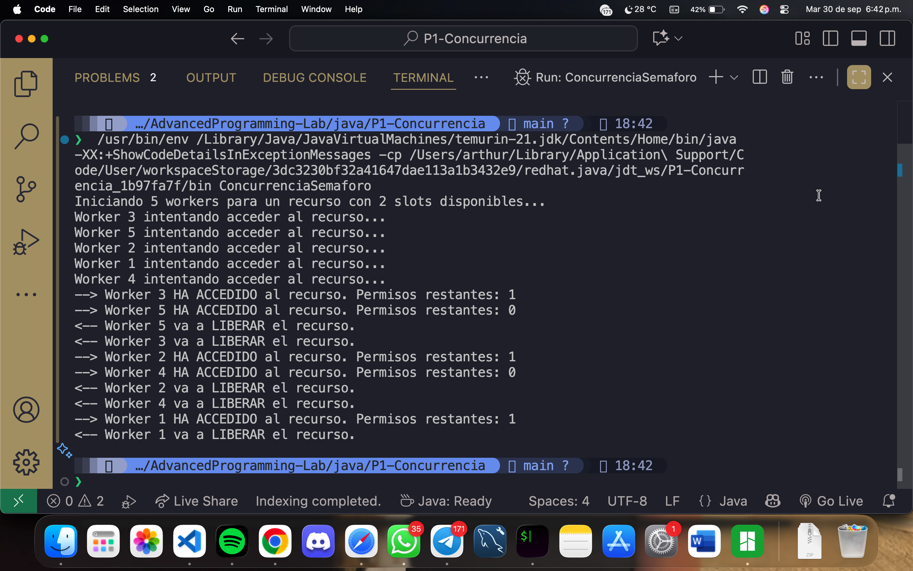
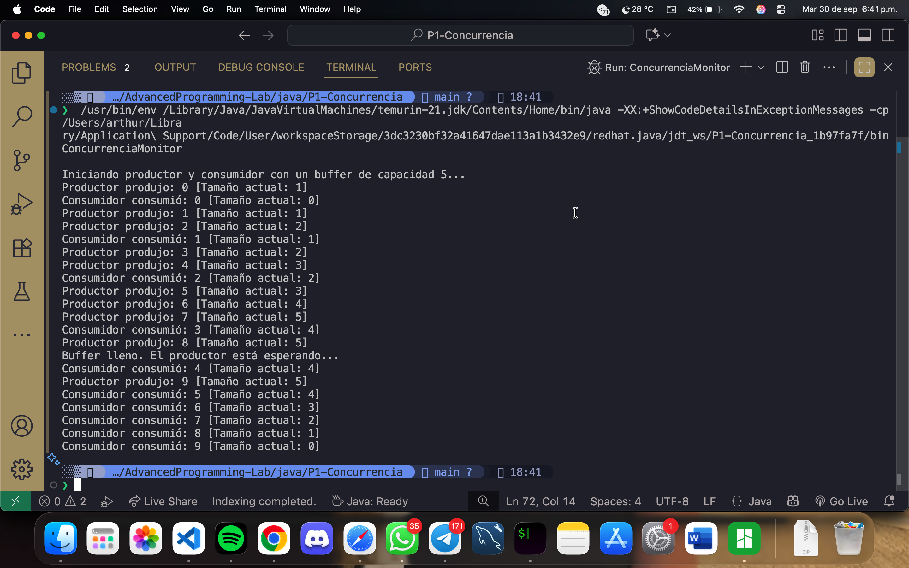

# Concurrencia y Exclusión Mutua en Java: Monitores y Semáforos
Este repositorio contiene una explicación detallada y ejemplos prácticos sobre cómo manejar la concurrencia en Java utilizando dos mecanismos de exclusión mutua: semáforos y monitores. El objetivo es demostrar cómo prevenir condiciones de carrera y asegurar la integridad de los datos en aplicaciones multihilo.

# Introducción al Problema de la Condición de Carrera
Una condición de carrera (race condition) es uno de los problemas más fundamentales y peligrosos en la programación concurrente. Ocurre cuando dos o más hilos de ejecución acceden a un recurso compartido (como una variable, un archivo o un objeto) de manera simultánea, y al menos uno de ellos modifica dicho recurso. El resultado final de la operación depende del orden, a menudo impredecible, en que los hilos son planificados por el sistema operativo para acceder al recurso.

Imaginemos una analogía simple: una cuenta bancaria compartida con un saldo de $1000. Dos personas (hilos) intentan retirar dinero al mismo tiempo.

Hilo A quiere retirar $200. Lee el saldo ($1000).

Hilo B quiere retirar $100. Antes de que el Hilo A pueda completar su operación, el Hilo B también lee el saldo ($1000).

El Hilo A calcula su nuevo saldo: $1000 - $200 = $800.

El Hilo B calcula su nuevo saldo: $1000 - $100 = $900.

El Hilo A actualiza el saldo de la cuenta a $800.

Inmediatamente después, el Hilo B actualiza el saldo a $900.

El saldo final es $900, lo cual es incorrecto. Se han retirado $300 en total, por lo que el saldo debería ser $700. El retiro de $200 del Hilo A se "perdió" porque el Hilo B sobrescribió su resultado. Esta inconsistencia es el resultado directo de no proteger la "sección crítica" (el bloque de código que lee, modifica y escribe el saldo). La exclusión mutua es la técnica utilizada para garantizar que solo un hilo pueda ejecutar una sección crítica a la vez, evitando así las condiciones de carrera.

## Semáforos
Un semáforo es una variable especial (un contador entero) que actúa como un guardián para controlar el acceso a un conjunto de recursos compartidos. Fue conceptualizado por Edsger Dijkstra y funciona con dos operaciones atómicas (indivisibles):

#### wait() o acquire():
Esta operación decrementa el valor del semáforo. Si el valor resultante es negativo, el hilo que la ejecuta se bloquea y se pone en una cola de espera. Si el valor es mayor o igual a cero, el hilo continúa su ejecución.

#### signal() o release():
Esta operación incrementa el valor del semáforo. Si hay hilos bloqueados esperando en la cola del semáforo, uno de ellos es desbloqueado y se le permite continuar.

Existen dos tipos principales de semáforos:

#### Semáforo Binario (Mutex): 
Su contador solo puede tomar los valores 0 o 1. Se usa para garantizar la exclusión mutua en una sección crítica, permitiendo que solo un hilo acceda a la vez. Es como una llave para una habitación: solo quien la tiene puede entrar.

#### Semáforo de Conteo: 
Su contador puede tomar cualquier valor no negativo. Se utiliza para controlar el acceso a un número limitado de recursos (N). Por ejemplo, si tenemos una piscina con 3 carriles de nado disponibles, un semáforo inicializado en 3 permitiría que hasta 3 nadadores (hilos) entren a la vez.

## Monitores
Un monitor es una construcción de más alto nivel que un semáforo, diseñada para simplificar la programación concurrente. Un monitor es un objeto o módulo que encapsula tanto los datos compartidos como los procedimientos que operan sobre esos datos. Su característica principal es que garantiza que solo un hilo puede estar activo dentro del monitor en un momento dado.

En Java, los monitores no son una clase explícita, sino un patrón implementado a través de la palabra clave synchronized y los métodos wait(), notify() y notifyAll() de la clase Object.

#### synchronized:
Cuando un método o bloque de código es declarado como synchronized, Java asocia un "cerrojo" (lock) intrínseco con el objeto. Para que un hilo pueda ejecutar ese código, primero debe adquirir el cerrojo. Mientras un hilo lo posea, ningún otro hilo podrá adquirirlo y, por lo tanto, no podrá ejecutar ningún otro bloque synchronized del mismo objeto.

#### wait():
Hace que el hilo actual libere el cerrojo y entre en un estado de espera.

#### notify() / notifyAll():
Despiertan a uno (notify) o a todos (notifyAll) los hilos que están esperando en el cerrojo de ese objeto.

Los monitores son una solución más segura y estructurada que los semáforos, ya que la exclusión mutua es automática y el programador no tiene que preocuparse por adquirir y liberar los cerrojos manualmente, reduciendo el riesgo de errores como el olvido de liberar un semáforo.

# Conclusion
La exclusión mutua no es una opción, sino un requisito fundamental para garantizar la consistencia y fiabilidad de los datos en entornos multihilo.

Los semáforos son una herramienta de sincronización potente y flexible. Son ideales para escenarios donde se necesita controlar el acceso a un número finito de recursos compartidos, como limitar el número de hilos que ejecutan una tarea costosa simultáneamente. Sin embargo, su uso incorrecto (por ejemplo, olvidar liberar un permiso) puede conducir a interbloqueos (deadlocks) difíciles de depurar.

Los monitores, implementados en Java a través del mecanismo synchronized, ofrecen un nivel de abstracción superior. Al encapsular el estado compartido y la lógica de sincronización dentro de un mismo objeto, reducen drásticamente la probabilidad de errores. Son la opción preferida para proteger la integridad de un objeto y coordinar interacciones complejas entre hilos, como en el patrón productor-consumidor.